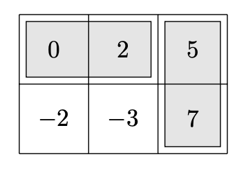

# Task: DOMINO

## Domino    
Available memory: 128 MB.  

Each cell of a rectangular k×n board contains an integer. Placing **domino tiles** (1×2) on this board involves positioning a certain number of tiles so that each tile covers exactly two cells, and no cell is covered by more than one tile. The **value** of such an arrangement is the sum of the numbers on the covered cells.

## Input  
The first line of the input contains two integers: **n, k** (1 ≤ n ≤ 1000, 1 ≤ k ≤ 12).  

Each of the next **k** lines contains **n** integers, separated by single spaces, within the range **−10⁶ to 10⁶**, representing the values on the board. More precisely, the **i-th** row (1 ≤ i ≤ k) contains the numbers **aᵢ,₁, aᵢ,₂, ..., aᵢ,ₙ**, where **−10⁶ ≤ aᵢ,ᵧ ≤ 10⁶** for **1 ≤ j ≤ n**.  

For every **i = 1, ..., k** and **j = 1, ..., n**, the value at board position **(i, j)** is **aᵢ,ᵧ**.

## Output  
Your program should output a single integer equal to the **maximum possible value** of a valid domino placement.

## Example  

**Input:**  
```
3 2
0 2 5
-2 -3 7
```

**Correct output:**  
```
14
```

## Explanation  

By using two domino tiles, we can achieve a sum of **14**:



